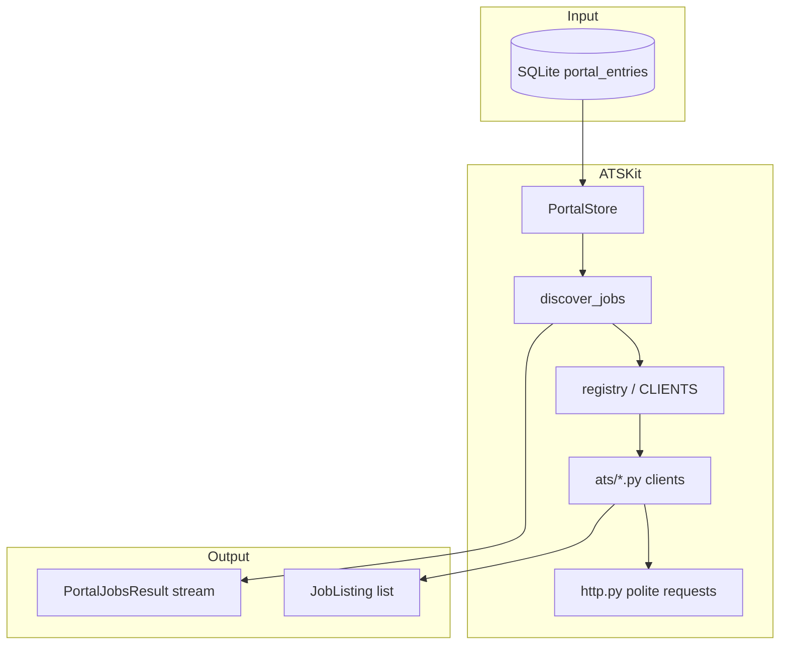

# Architecture

ATSKit is a thin orchestration layer over per-ATS client modules. It does not run a server, schedule cron jobs, or own application state beyond the `portal_entries` table you point it at.

## High-level flow

## Module map

| Module | Role |
|--------|------|
| `discover.py` | Thread-pooled cross-portal discovery; yields `PortalJobsResult` as each portal finishes |
| `persistence.py` | `PortalStore` — CRUD for `portal_entries` only |
| `portal_map.py` | Build/sync portal list from applied-job URLs or built-in enterprise boards |
| `registry.py` | Maps portal key → client module (`get_client`, `CLIENTS`) |
| `service.py` | Thin wrappers: `list_jobs`, `fetch_description`, URL-based fetch |
| `url.py` | `classify_url`, `clean_url` — parse job URLs into portal/slug/job_id |
| `http.py` | Shared rate limiting, retries, browser-like headers, HTML→Markdown |
| `models.py` | Pydantic models: `JobListing`, `PortalEntry`, `PortalJobsResult`, … |
| `ats/*.py` | One module per ATS — implements `list_jobs(slug)` and usually `fetch_description(slug, job_id)` |
| `cli.py` | Optional `atskit` console entry point |

## Design principles

**Caller-owned database.** ATSKit never hardcodes a DB path. Pass any SQLite file; only the `portal_entries` table is touched (created if missing).

**Streaming by portal.** `discover_jobs` uses `ThreadPoolExecutor` + `as_completed` so consumers see results as each ATS query finishes, not after all portals complete.

**Fail soft per portal.** A single portal error becomes `PortalJobsResult.error`; other portals still yield. Empty lists are returned on HTTP failures inside clients rather than raising through the discovery loop.

**Polite HTTP.** All clients should use `polite_get` / `polite_post` from `http.py` for per-host spacing and retry on 429/5xx (see [HTTP and rate limits](http-and-rate-limits.md)).

**No hidden global state.** Rate-limit timestamps live in `http.py` (process-wide per host). Portal scan dates live in your SQLite file.

## Portal population vs discovery

Two separate concerns:

1. **Population** (`build_portals`, `sync_portals_from_applied`) — figure out *which companies* to track from sample job URLs.
2. **Discovery** (`discover_jobs`) — query each stored portal for *current open jobs*.

Population is optional. You can insert `portal_entries` rows yourself or use `example.db` as a starting point.

## Integration pattern

Downstream apps (e.g. [VOYAGER](https://github.com/nirmalhk7/VOYAGER)) typically:

1. Sync portals from their own applied-jobs source via `build_portals(db, applied_jobs=provider)`.
2. Run `discover_jobs(db)` and apply their own filters, deduplication, and persistence.
3. Use `fetch_description` or `fetch_description_for_url` when a full JD is needed.

ATSKit stops at normalized `JobListing` objects; ranking, AI filtering, and application tracking stay in the consumer.
